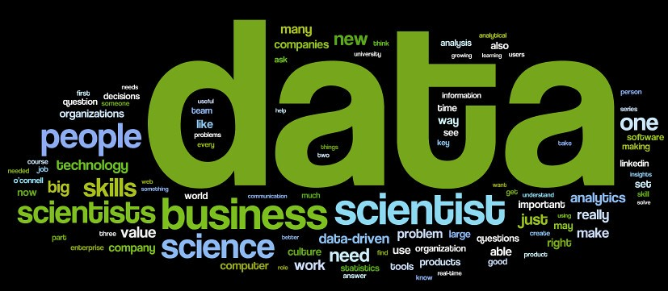

<h1 align="center">Hello 👋, I'm Priyansh</h1>

<h3 align = 'center'>Data Analyst | Data Engineer | Data Scientist | ML & AI Enthusiast</h3>  
  

 
  

 

### Welcome to my Git profile! 

I'm Priyansh, a highly motivated and passionate Data Enthusiast with a strong background in Data Analysis, Machine learning and Artificial intelligence. With a keen interest in solving complex problems using data-driven approaches, I strive to make a positive impact through innovative and insightful data analysis. 

### 🌟 About Me

🔭 **Current Focus**: Pursuing a Master’s in Big Data Analytics at San Diego State University, with a strong focus on applying advanced analytics and data engineering techniques.

🌱 **Exploring Opportunities**: Passionate about Data Analytics, Data Science, Data Engineering, Machine Learning, and AI. Always eager to innovate and solve complex challenges in these domains.

🤝 **Team-Oriented**: I excel in collaborative environments, bringing together diverse perspectives to drive impactful solutions and ensure project success.

💬 **Let’s Talk Tech**: Reach out to chat about SQL, Python, Data Science, Data Engineering, Cloud Services, and Project Management.

